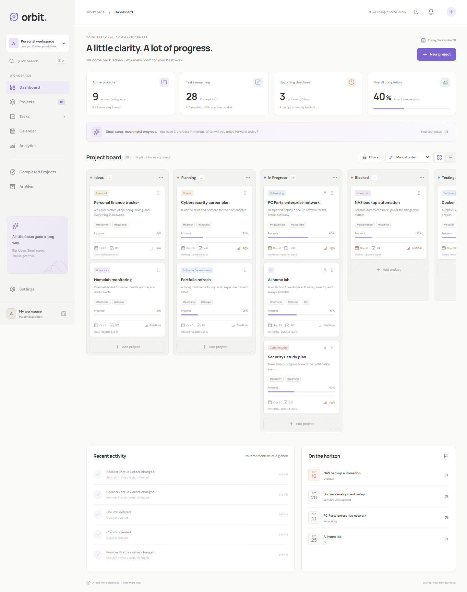
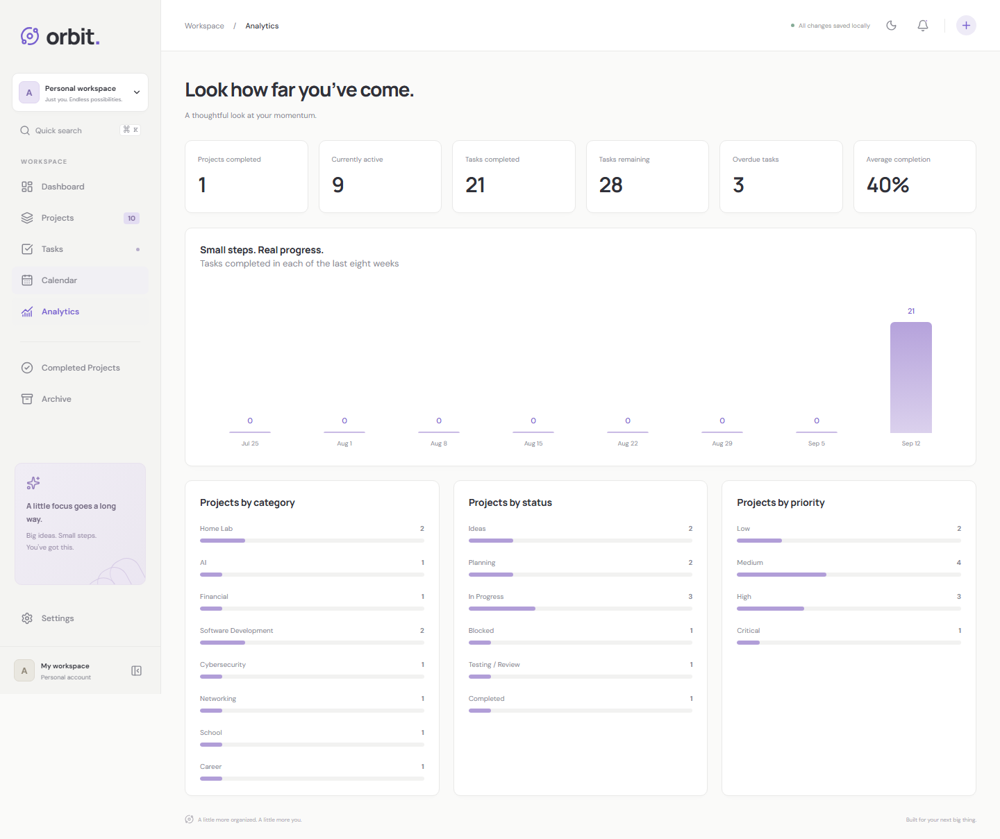
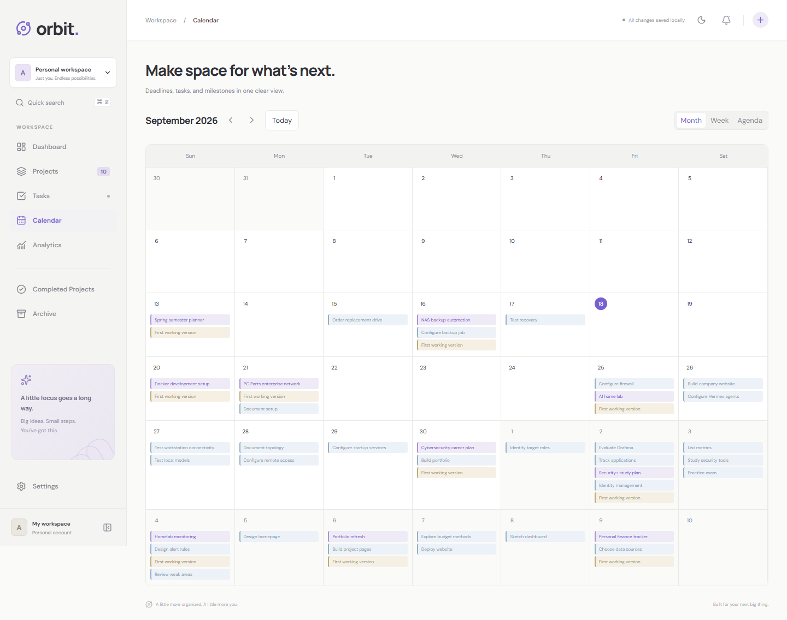
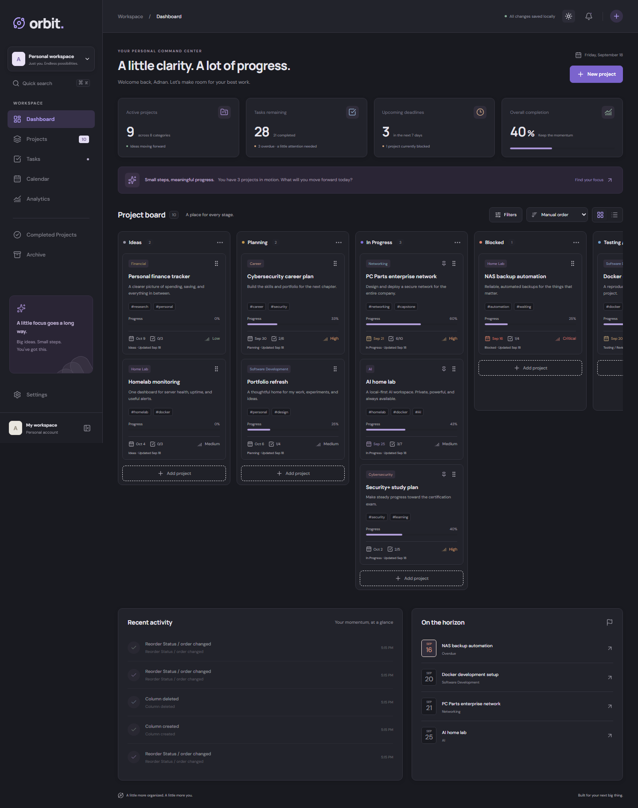
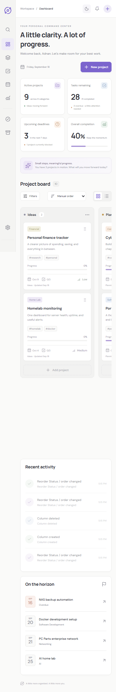

# Orbit

A personal project command center built with Next.js App Router, React, TypeScript, Prisma, SQLite, dnd-kit, Lucide, and React Markdown. The responsive interface includes light and dark themes, a six-stage project board, task management, notes, milestones, calendar, analytics, search, archive, and activity history.

## Screenshots

### Dashboard



### Analytics



### Calendar



### Dark mode



### Mobile view



## Run locally

Requirements: Node.js 22 LTS and npm. An internet connection is needed for the initial dependency and Prisma engine downloads.

```powershell
npm install
Copy-Item .env.example .env
npm run setup
npm run dev
```

Open **http://127.0.0.1:3000**. On macOS/Linux, use `cp .env.example .env` instead of `Copy-Item`.

Setup generates Prisma Client, creates the schema, and seeds ten editable projects. Seed dates are relative to the day you run setup. Seeding skips a database that already has projects. The supplied `.env` is already configured for local development.

```powershell
npm run typecheck
npm run build
npm start
```

The production server uses the same local database. Stop the development server before starting the production server on port 3000.

## Everyday use

- Create projects with the New project button. Include starter tasks and initial notes, or add these in the project workspace.
- Drag the grip in a project card to move or reorder it. Keyboard: focus the grip, press Space, use arrow keys, then press Space. When sorting by a field, choose Manual order to see stored drag order.
- Click a column title to collapse it; use its menu to rename it, change color, set a WIP limit, or delete an empty column. Move every project, including archived projects, out before deleting a column.
- Open a project to edit details, mark tasks complete, manage subtasks, write Markdown notes, and create milestones. Task board mode supports dragging between statuses and reordering inside each status.
- Progress is calculated from completed tasks by default. Disable automatic progress in the project form to use a manual percentage.
- Filter projects by category, status, priority, tags, deadline, or completion. Tasks have project, priority, status, category, tag, and exact deadline filters plus time-based views.
- Ctrl/Cmd+K searches project descriptions, task titles/descriptions/notes/tags, project notes, and project tags. Archived projects remain searchable.
- The calendar provides month, week, and agenda views; events open the associated project workspace.
- Analytics derive from saved data. Weekly completion counts use task completion timestamps, with eight rolling seven-day periods ending today.
- Archive or restore a project inside its workspace. Permanent deletion requires confirmation and cascades to its tasks, subtasks, notes, and milestones.
- The global + creates projects, tasks, notes, or milestones. Notes and milestones use the currently open project, or the first project when no project is open; the dialog identifies the destination.
- Theme and sidebar preferences persist in browser local storage. Workspace data persists in SQLite. Export a readable JSON snapshot in Settings; this is an export, not an import/restore format.

## Data and architecture

`prisma/schema.prisma` defines normalized projects, columns, categories, tags, tasks, subtasks, notes, milestones, and activities. Project/task tags use many-to-many relations. Child project data cascades on deletion; activity records retain their text when a project is deleted.

`app/orbit/api/workspace/route.ts` exposes a local JSON API with field allowlists, required-name validation, cross-origin mutation checks, and transactional drag ordering. Writes return a fresh database snapshot so views stay synchronized without page reloads. Mutations are serialized within each open client and report server errors in a toast.

UI modules live in `components/`: `Workspace`, `Board`, `Forms`, `Tasks`, `ProjectDetail`, `Views`, and shared `ui` primitives. `lib/db.ts` owns Prisma access and snapshots; `lib/types.ts` owns shared UI types and progress/date helpers. Styling uses maintainable CSS variables and reusable classes rather than a component framework.

The database defaults to `prisma/dev.db` (`DATABASE_URL="file:./dev.db"`). Back up this file with the app stopped. Never commit your personal database or `.env`. `npm run db:push` synchronizes schema changes; review Prisma warnings before accepting a destructive schema change. There is no authentication or multiuser conflict resolution: this is a local single-person application, and the supplied start scripts bind to loopback.

Fonts are loaded from Google Fonts with local sans-serif fallbacks. The app remains usable without the font request succeeding. All project data stays on your machine.

## Browser tests

With the app running in another terminal:

```powershell
npx playwright install chromium
npm test
```

Tests exercise database-backed project creation/edit/deletion, task creation/completion, subtasks, notes, milestones, filtering, search, keyboard dragging, theme persistence, archive/restore, navigation, mobile overflow, and validation. Screenshots are saved in `test-results/`. Tests use your running database, create a uniquely named test project, and delete it after a successful run. A failed run can leave a test project that you can remove in the UI.

Final verification: the production build, TypeScript check, and all four Playwright tests passed. Pointer and keyboard dragging, task editing/deletion, custom columns, and preservation of task completion dates were also checked. Desktop/mobile preview checks reported no browser console errors or horizontal page overflow. Preview images are in `screenshots/`; regenerate them against a running local app with `npx tsx scripts/capture-preview.ts`.

Use `npm run format` to format source files. Patched `postcss` and `deepmerge-ts` transitive versions are pinned through npm overrides; the final dependency installation reported zero known vulnerabilities.

## Scope

This version covers the core workflow. Optional recurring tasks, dependencies, saved views, JSON import, and collaboration are not included. Calendar events open their parent workspace rather than a dedicated task route. WIP limits warn rather than block moves. Completed projects remain on the board until you archive them. The app uses server-confirmed updates rather than optimistic persistence, so errors cannot silently discard edits.

Implementation references: [Next.js route handlers](https://nextjs.org/docs/app/getting-started/route-handlers) and [Prisma SQLite](https://docs.prisma.io/docs/orm/v6/overview/databases/sqlite).
